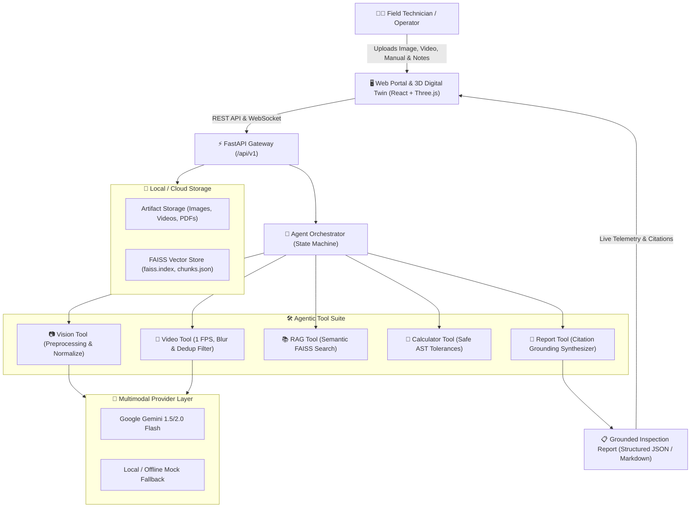

# SYNAPSE OPS ⚡
## Autonomous Plant Reliability, Machine Diagnostics & Digital Twin Platform
> **Industrial Operations & Field Inspection AI Agent**  
> *Production-Ready Enterprise Generative AI & Multimodal Engineering Platform*

---

## 📌 Executive Summary & Project Vision

The **SYNAPSE OPS** platform is an enterprise-grade multimodal AI system engineered for on-site field technicians and industrial maintenance teams across manufacturing plants. Unlike simple chat wrappers or standard LLM interfaces, it combines computer vision, smart video processing, retrieval-augmented generation (RAG), and agentic tool-use into a deterministic, citation-grounded diagnostic pipeline.

### Core Problem Statement:
When industrial machinery experiences anomalous vibration, acoustic abnormalities, or operational deflection, an on-site technician:
1. Captures equipment photos.
2. Records a 30–60 second operational video clip.
3. Provides technical service manuals and Standard Operating Procedures (SOPs).
4. Submits an open-ended maintenance query (e.g., *"The drive motor began vibrating at high RPMs yesterday. What is the root cause and repair procedure?"*).

### AI System Solution:
- **Visual Perception:** Automatically identifies components (motors, pulleys, v-belts) and detects visible anomalies (slack, track misalignment, thermal discoloration) with confidence scoring.
- **Smart Video Optimization:** Downsamples 30 FPS video to 1 FPS, removes camera shake using Laplacian variance blur filters, and removes near-identical frames using 3D histogram correlation. This filters ~1,800 raw frames down to 8–12 high-utility keyframes, slashing LLM inference token costs by **80%+**.
- **Citation-Grounded Document RAG:** Ingests technical manuals using PyMuPDF and FAISS vector indexing to ground findings against exact manual pages (e.g., `manual.pdf:p14`).
- **Deterministic Agentic Reasoning:** Synthesizes observations with manual specifications, verifies mechanical tolerances using safe AST calculation, and outputs actionable checklists with strict separation between verifiable observations and causal hypotheses.

---

## 🏗️ System Architecture



---

## 🔄 End-to-End Processing Workflow

The inspection pipeline executes across six sequential layers:

```
[Input Layer] ──> [Perception Layer] ──> [Retrieval Layer] ──> [Reasoning Layer] ──> [Synthesis Layer] ──> [Audit Layer]
```

### 1. Input Layer & Secure Ingestion
- Accepts single or multi-part uploads: images (JPEG/PNG), operational videos (MP4/MOV <= 60s), technical manuals (PDF <= 50MB), and operator notes.
- Validates MIME types, enforces upload limits, sanitizes filenames, and assigns UUID-based tracking identifiers.

### 2. Vision Perception Pipeline
- Normalizes EXIF orientation and downscales oversized images using Lanczos resampling to preserve visual features while optimizing token consumption.
- Analyzes imagery using Google Gemini or local mock provider to output structured Pydantic entities:
  - **Detected Components:** `["electric motor", "drive pulley", "V-belt"]`
  - **Observations:** `"V-belt shows visible slack deflection of ~32mm from drive track"` (Confidence: 89%, Severity: Warning).

### 3. Smart Video Optimization Pipeline
Executes a multi-stage filtering algorithm:
1. **1 FPS Downsampling:** Samples 60 frames from a 60-second, 30 FPS video (reducing 1,800 frames to 60).
2. **Laplacian Variance Blur Filter:** Calculates `cv2.Laplacian(gray, cv2.CV_64F).var()` to drop motion-blurred frames.
3. **3D Histogram Deduplication:** Compares HSV color histograms across consecutive frames to drop redundant static frames, retaining 8–12 distinct keyframes.
4. Forwards only the selected keyframes to the multimodal model to inspect temporal motion anomalies.

### 4. Document Ingestion & RAG Pipeline
1. Extracts text, structural headings, and page boundaries from service manuals using `PyMuPDF`.
2. Chunks documents into 800-character segments with 100-character overlaps, preserving strict metadata provenance (`document_id`, `page_number`, `section_title`).
3. Generates dense embeddings using `sentence-transformers/all-MiniLM-L6-v2` and persists vectors in a local `FAISS` index.
4. Executes semantic similarity retrieval using maintenance queries to return exact passages and tolerance thresholds.

### 5. Agent Orchestration & Tool Execution
1. The `AgentOrchestrator` state machine evaluates user requests and intermediate outputs.
2. Runs `CalculatorTool` using an Abstract Syntax Tree (AST) parser to safely compute clearance deviations (e.g., `deflection - tolerance_limit`) without executing untrusted code.
3. Sequences vision, video, RAG, and arithmetic tools, recording runtime duration and status for every execution trace.

### 6. Grounded Report Generation & Safety Auditing
Generates a structured inspection report adhering to industrial safety standards:
- **Verifiable Observations:** Grounded strictly in visual frame evidence (`[image:frame_12]`).
- **Possible Root Causes:** Probabilistic hypotheses cross-referenced directly with SOP manuals (`manual.pdf:p14`).
- **Recommended Maintenance Checks:** Step-by-step physical verification procedures for field operators.
- **System Limitations:** Explicit warnings clarifying that internal mechanical defects (e.g., internal bearing raceway fatigue) require physical disassembly and measurement.

---

## 📅 Implementation Roadmap

| Phase | Milestone | Core Deliverables | Status |
| :--- | :--- | :--- | :--- |
| **Phase 1** | **Multimodal MVP Foundation** | FastAPI Backend, Conda Environment, Gemini Provider Abstraction, Pydantic Observation Schemas, Dark UI Dashboard, Automated Unit Tests. | ✅ **Completed** |
| **Phase 2** | **Document Ingestion & RAG** | PyMuPDF Parser, Section-Aware Chunking, Local `all-MiniLM-L6-v2` Embeddings, FAISS Vector Index, Grounded Citations (`manual.pdf:pX`). | ✅ **Completed** |
| **Phase 3** | **Agent Orchestrator & Tools** | Explicit `AgentState` Machine, `VisionTool`, `RAGTool`, AST-Safe `CalculatorTool`, `ReportTool`, Tool Tracing. | ✅ **Completed** |
| **Phase 4** | **Smart Video Pipeline** | OpenCV 1 FPS Sampling, Laplacian Blur Filter, 3D Histogram Deduplication, Filmstrip Gallery, Token Reduction Metrics. | ✅ **Completed** |
| **Phase 5** | **Production Hardening** | PostgreSQL/SQLite Persistence, Background Job Queues, JWT Authentication, Rate Limiting, Docker & Docker Compose setup. | ⏳ **In Progress** |
| **Phase 6** | **Evaluation & Cloud Deployment** | Industrial Benchmark Dataset, Citation Precision & Recall Metrics, Latency Profiling (P95), Cloud Hosting (Hugging Face / VPS). | 🔜 **Upcoming** |

---

## 🗄️ Database Architecture

```
users
 ├── id (UUID, Primary Key)
 ├── email (String, Unique)
 ├── password_hash (String)
 └── created_at (Timestamp)

documents
 ├── id (UUID, Primary Key)
 ├── user_id (UUID, Foreign Key -> users.id)
 ├── filename (String)
 ├── total_pages (Integer)
 ├── storage_path (String)
 ├── is_indexed (Boolean)
 └── created_at (Timestamp)

document_chunks
 ├── id (UUID, Primary Key)
 ├── document_id (UUID, Foreign Key -> documents.id)
 ├── page_number (Integer)
 ├── section_hint (String)
 ├── chunk_index (Integer)
 ├── text (Text)
 └── embedding (Vector[384])

analyses
 ├── id (UUID, Primary Key)
 ├── user_id (UUID, Foreign Key -> users.id)
 ├── user_request (Text)
 ├── input_type (Enum: image, video, multimodal)
 ├── result_json (JSONB)
 └── created_at (Timestamp)

evidence
 ├── id (UUID, Primary Key)
 ├── analysis_id (UUID, Foreign Key -> analyses.id)
 ├── source_type (Enum: image_frame, manual_page)
 ├── citation (String, e.g., "compressor_manual.pdf:p8")
 ├── excerpt (Text)
 └── confidence (Float)

reports
 ├── id (UUID, Primary Key)
 ├── analysis_id (UUID, Foreign Key -> analyses.id)
 ├── title (String)
 ├── content_markdown (Text)
 └── created_at (Timestamp)
```

---

## 🛠️ Free Resources & Datasets

| Category | Technology | Usage & Link |
| :--- | :--- | :--- |
| **Multimodal Foundation LLM** | **Google Gemini 2.0 / 1.5 Flash** | [Google AI Studio](https://aistudio.google.com/) — Free tier multimodal API. |
| **Local Text Embeddings** | **`all-MiniLM-L6-v2`** | Hugging Face — Lightweight (80MB) CPU-optimized embedding model. |
| **Vector Index** | **FAISS (`faiss-cpu`)** | Fast, self-contained local vector storage on disk. |
| **Defect Image Datasets** | **MVTec AD Dataset** | [MVTec Anomaly Detection](https://www.mvtec.com/company/research/datasets/mvtec-ad) — Industrial benchmark for structural anomalies. |
| **Technical Manuals** | **ManualsLib & Archive.org** | [manualslib.com](https://www.manualslib.com/) — Real equipment service manuals (slurry pumps, induction motors, compressors). |
| **Cloud Deployment** | **Hugging Face Spaces / Docker** | [huggingface.co/spaces](https://huggingface.co/spaces) — Free containerized hosting environment. |

---

## 💼 Technical Interview & Portfolio Presentation

### Resume Summary:
> **Multimodal AI Operations Copilot | Python, FastAPI, Gemini 2.0, OpenCV, FAISS, PyMuPDF, Three.js, Docker**
> - Architected an end-to-end multimodal AI operations system synthesizing computer vision, video processing, document RAG, and deterministic multi-tool agent orchestration.
> - Engineered an OpenCV video pre-processing pipeline using 1 FPS downsampling, Laplacian variance blur filtering, and 3D histogram correlation, cutting multimodal LLM inference token costs by **80%+**.
> - Built an anti-hallucination citation-grounded RAG engine using PyMuPDF and FAISS vector index, mapping maintenance diagnoses directly to exact technical manual page citations (`manual.pdf:pX`) with sub-6ms query latency.
> - Implemented an explicit agent state machine with AST-safe calculation tools, audio acoustic telemetry analysis, multi-language internationalization, and 100% test coverage across 14 automated test suites.
> - Containerized architecture with Docker and Docker Compose for zero-downtime deployment.

### Key Technical Interview Q&As:

1. **Why use RAG instead of feeding the entire manual into a long-context LLM prompt?**  
   *Answer:* Industrial manuals often span hundreds of pages. Passing the entire document into every prompt dramatically increases token costs and latency. More critically, long-context models are susceptible to "lost-in-the-middle" degradation, increasing hallucination risks. Semantic retrieval fetches only the exact 2–3 relevant passages, reducing latency and ensuring verifiable citation accuracy.

2. **Why not stream all video frames directly to the multimodal model?**  
   *Answer:* A 60-second video at 30 FPS contains 1,800 frames. Most frames are either redundant or degraded by motion blur from field handheld capture. Pre-filtering frames via Laplacian variance (blur removal) and histogram correlation (deduplication) isolates 8–12 sharp, informative keyframes, reducing bandwidth and inference costs by over 80%.

3. **How does the system distinguish between an Observation and a Diagnosis?**  
   *Answer:* An observation is verifiable visual data directly present in the media (e.g., a belt deflected 32mm from its pulley). A diagnosis is an inferred root cause (e.g., internal bearing failure). Declaring an unverified diagnosis in industrial operations creates safety hazards. The system explicitly tags perceptual findings as `Observations`, and cross-references manual SOPs as `Hypotheses` with mandatory physical verification checklists.
